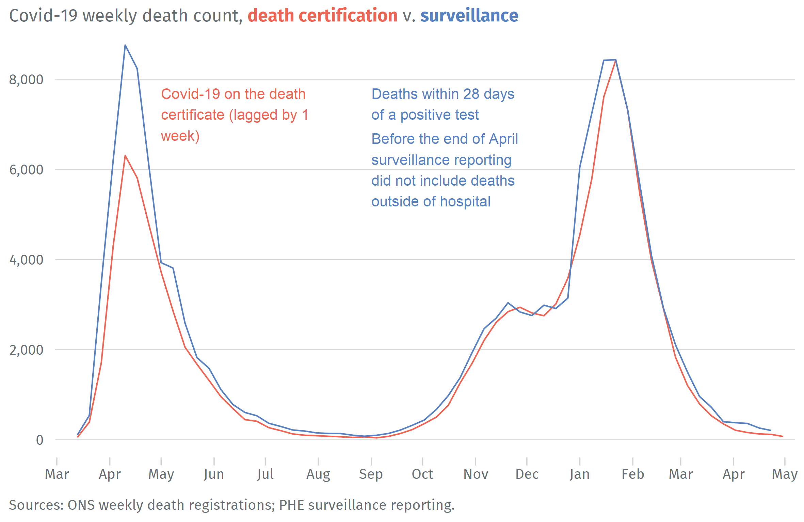

# Introduction 
Considerable effort has been directed to track the severity and public health impact of coronavirus disease 2019 (Covid-19). Understanding the mortality impact of Covid-19 both over time and between countries is vital for distinguishing the relative effectiveness of different prevention and control measures, including vaccines. The efforts of individuals like John-Burn Murdoch, creator of the Financial Times' coronavirus trajectory tracker charts,[@noauthor_coronavirus_nodate] are to be commended and have undoubtedly helped people attempt to make sense of what's happening in a fast-changing situation. 

As the most direct indicator of mortality much attention has been given to the number of deaths caused by Covid-19; but within the field of public health there are established measures that can help provide a fuller picture of the mortality burden of Covid-19. This report begins by explaining the different sources of information on Covid-19 deaths before comparing approaches to estimating 'excess deaths' &mdash; a better, more complete measure of the coronavirus pandemic's overall mortality impact. In the second half of the report, we implement a set of actuarial and public health metrics &mdash; standardised death rates, years-of-life-lost and life expectancy &mdash; that offer a different perspective on the pandemic's effect on population health.


```r
# read data
govDths           <- readRDS(str_c(.datDir, "dat02_gov_daily_covidDths.RDS"))
wkDthsTot         <- readRDS(str_c(.datDir, "dat05_total_weekly_deaths_2010_to_2021.RDS"))
onsDths           <- readRDS(str_c(.datDir, "dat05_total_weekly_covidDths_2020_to_2021.RDS"))
wkDthsAgeGrp      <- readRDS(str_c(.datDir, "dat05_age_grp_weekly_deaths_2010_to_2021.RDS"))
covidAgeGrpDths   <- readRDS(str_c(.datDir, "dat05_age_grp_weekly_covidDths_2020_to_2021.RDS"))
xsDthsMod         <- readRDS(str_c(.datDir, "asis06_xs_deaths_model_results.RDS"))
xsDthsSimple      <- readRDS(str_c(.datDir, "asis06_xs_deaths_simple_counterfactuals.RDS"))
xsDthsSumTb       <- readRDS(str_c(.datDir, "asis06_xs_deaths_summary_table.RDS"))
xsDthsModAgeGrp   <- readRDS(str_c(.datDir, "asis06_xs_deaths_model_age_grp_results.RDS"))
xsDthsv2019AgeGrp <- readRDS(str_c(.datDir, "asis06_xs_deaths_v2019_age_grp.RDS"))
smr15to85         <- readRDS(str_c(.datDir, "asis07_smr15to85.RDS"))
rcSmr15to85       <- readRDS(str_c(.datDir, "asis07_rcSmr15to85.RDS"))
leSeries          <- readRDS(str_c(.datDir, "asis09_life_expectancy_2002_to_2019.RDS")) 
le2020            <- readRDS(str_c(.datDir, "asis09_life_expectancy_2020.RDS"))
yll_ls            <- readRDS(str_c(.datDir, "asis08_years_of_life_lost.RDS"))

# values used in text
yx2020CovidDths   <- onsDths %>% filter(isoYr == 2020) %>% summarise(dths = sum(dths)) %>% pull()
yx2020Dths        <- wkDthsTot %>% filter(isoYr == 2020) %>% summarise(dths = sum(dths)) %>% pull()
yx2020CovidDthsPc <- scales::percent(yx2020CovidDths / yx2020Dths, accuracy = .1)
qxSmrMaxWk        <- smr15to85 %>% filter(qxSmr == max(qxSmr, na.rm = TRUE)) %>% pull(isoWk)
qxSmrMaxWkEndDt   <- smr15to85 %>% filter(qxSmr == max(qxSmr, na.rm = TRUE)) %>% pull(isoYrWk)
qxSmrMaxWkEndDt   <- ISOweek::ISOweek2date(str_c(qxSmrMaxWkEndDt, 5, sep = "-"))
qxSmrMaxWkEndDt   <- paste(day(qxSmrMaxWkEndDt), months(qxSmrMaxWkEndDt), year(qxSmrMaxWkEndDt))
totCovidDths      <- round(xsDthsSumTb %>% filter(wave == "Total") %>% pull(dths19), -2)
yllTot            <- round(yll_ls[[1]] %>% summarise(yll = sum(yll)) %>% pull(yll), -2)
le20F             <- le2020 %>% filter(gender == "f") %>% pull(expBirth)
le20M             <- le2020 %>% filter(gender == "m") %>% pull(expBirth)
le20FChg          <- abs(le2020 %>% filter(gender == "f") %>% pull(expBirth)
                         - leSeries %>% filter(year == "2019", gender == "f") %>% pull(expBirth))
le20MChg          <- abs(le2020 %>% filter(gender == "m") %>% pull(expBirth)
                         - leSeries %>% filter(year == "2019", gender == "m") %>% pull(expBirth))

pct75Plus <- covidAgeGrpDths %>%
  group_by(ageGrp) %>%
  summarise(dths = sum(dths)) %>%
  mutate(csDths = cumsum(dths)) %>%
  mutate(csPct = csDths / sum(dths)) %>%
  filter(ageGrp == "70-74") %>%
  mutate(pct75Plus = 1 - csPct) %>%
  pull(pct75Plus)

pct75Plus <- scales::percent(pct75Plus, accuracy = 1)
```

# How many people have died from Covid-19?
The infection fatality ratio (IFR; the proportion of those infected who will go on to die from that infection) is a key statistic for estimating the burden of Covid-19 and estimates have continuously been updated throughout the current pandemic. The overall IFR will vary across different populations as it depends on factors such as the age distribution of the population, the distribution of infection across age groups, and access to healthcare resources. After reviewing multiple seroprevalence studies (where blood tests are used to identify how many people have antibodies against the SARS-CoV-2 virus) from different countries the Covid-19 response team at Imperial College estimated the overall IFR for a typical high income country, with a greater concentration of elderly individuals, to be 1.15% (0.78&ndash;1.79 95% prediction interval range).[@noauthor_report_nodate] Over time improvements in care and potential genetic mutations in the virus[@challen_risk_2021] have the potential to alter the IFR.

## Covid-19 deaths data
There are two broad ways of counting Covid-19 deaths in the UK: statistics reported through health and care organisations, usually focused on cases where a positive test for Covid-19 has been confirmed, and statistics reported through the process of death registration, where Covid-19 appears on the death certificate. Differences in the timeliness and coverage of these sources were not always well explained and changes to the methodology used by the government for daily surveillance reporting did not help in this regard.

The main sources of Covid-19 deaths data are:

1. Public Health England (PHE) publish daily surveillance figures on deaths of people who died within 28 days of a first positive test for Covid-19.[@public_health_england_deaths_2021] The daily number represents new deaths reported to PHE by public health bodies in the 24 hours up to 5pm the previous day. From 29 April 2020, these are based (for England) on improved data, which provide a count of all deaths where a positive test for Covid-19 has been confirmed, wherever the death took place. Prior to this, the series did not include those who died outside of hospital settings e.g. in a care home. The 28-day cut-off was only introduced in August, before this time PHE reported deaths of all people with a confirmed positive test at any point since the start of the pandemic. 
2. NHS England (NHSE) publish a daily count of people who died in hospitals in England and had either tested positive for Covid-19 or where Covid-19 was mentioned on the death certificate.[@nhs_england_covid-19_2021] The daily count contains deaths from the latest reporting period, 4pm two days prior to publication until 4pm the day before publication. From 28 April 2020, this series changed to include deaths where Covid-19 was mentioned on the death certificate. These figures do not include deaths outside hospital, such as those in care homes.
3. The Office for National Statistics (ONS) publish weekly deaths data for England and Wales, released every Tuesday at 9:30am for the week that ended 11 days prior (for example, data for the week ending 20 March 2020 were released on 31 March 2020).[@office_for_national_statistics_deaths_2021] These are based on registrations of deaths where confirmed or suspected Covid-19 was mentioned on the death certificate, wherever the death took place. Death certification as involving Covid-19 does not depend on a positive test.

These measures are collected for different purposes with different strengths and weaknesses. Counting deaths in people who have laboratory-confirmed infection does not require a judgement to be made about cause of death, which means figures can be collected more quickly &mdash; making it more useful for real-time surveillance. Surveillance reporting, however, is not designed to provide definitive information on the significance of Covid-19 as a cause of individual deaths. For example, in the early stages of the pandemic, there were deaths where Covid-19 was suspected but not confirmed by testing; for some patients testing positive for Covid-19 may be incidental or even unconnected to the cause of death. Mortality statistics published by the ONS rely on information recorded when deaths are certified and registered. These are published weekly but the death registration process means their availability is delayed. The certification of death includes a clinical assessment by a medical practitioner (often the patient's GP) of the reason for death; registrations of deaths where confirmed or suspected Covid-19 was mentioned on the death certificate provide the most objective measurement of deaths from Covid-19.

Prompt and accurate certification of death is essential as it serves a number of functions. In addition to providing the decedent's family with a cause of death, it has critical administrative and epidemiologic applications. In the UK, a medical certificate of cause of death is set out in two parts, in accordance with World Health Organisation recommendations. In part one the completing doctor identifies the underlying cause of death as 'a) the disease or injury which initiated the train of morbid events leading directly to death, or b) the circumstances of the accident or violence which produced the fatal injury'. Any other diseases, injuries, conditions, or events that contributed to the death, but were not part of the direct sequence are captured in part two. 

Most routine mortality statistics are based on the underlying cause, but the Covid-19 deaths numbers reported in the ONS weekly deaths data are for deaths 'involving Covid-19' &mdash; deaths that had Covid-19 mentioned anywhere on the death certificate, whether as an underlying cause or a contributory factor. For a subset of these deaths Covid-19 will have been identified as the underlying cause. According to the ONS, in around 90% of all deaths with Covid-19 mentioned on the death certificate it is recorded as the underlying cause of death.[@noauthor_quality_nodate] All ONS deaths data used in this report relate to this wider measure of deaths involving Covid-19.

>In the calendar year 2020 there were 80,830 deaths involving Covid-19 &mdash; 13.2% of the total 614,114 deaths that occurred in England & Wales.

Figure \@ref(fig:covid-dths-data) compares PHE daily surveillance counts with ONS death registrations. The PHE data is aggregated to the same weekly period as the registrations and the registrations have been shifted by one week to account for the period between death and registration (c.75% of deaths are registered within 7 calendar days).[@office_for_national_statistics_impact_2020] In the early stages of the pandemic, PHE reporting was limited to deaths of patients testing positive that occurred in hospital. From the end of April, the surveillance and death registrations series track closely showing two distinct waves separated by a 'Summer lull'.


```r
onsDths <- onsDths %>% 
  rownames_to_column() %>%
  mutate(isZeroCnt = (dths == 0 & lag(dths, default = 0) == 0)) %>%
  filter(!isZeroCnt) %>% 
  mutate(wkEnding = ISOweek::ISOweek2date(str_c(isoYrWk, 5, sep = "-"))) %>% 
  select(-rowname)

wkEndingDts <- onsDths %>%
  select(wkEnding) %>%
  mutate(wkEndingDt = wkEnding) %>%
  distinct()

pheDths <- govDths %>% 
  left_join(wkEndingDts, by = c("date" = "wkEnding")) %>% 
  mutate(wkEnding = zoo::na.locf(wkEndingDt, fromLast = TRUE, na.rm = FALSE)) %>%
  filter(!is.na(wkEnding)) %>%  
  group_by(wkEnding) %>% 
  summarise(dths = sum(dths))

subtitle_lab <- "Covid-19 weekly death count, <span style='color:#ec6555;'>**death certification**</span><span style='color:#686f73;'> v. </span><span style='color:#5881c1;'>**surveillance**</span>"

ggplot() +
  geom_line(aes(x = wkEnding, y = dths, group = 1), data = pheDths, color = "#ec6555") +
  geom_line(aes(x = wkEnding, y = lead(dths, 1), group = 1), data = onsDths, color = "#5881c1") +
  scale_x_date(name = NULL, date_breaks = "1 month", date_labels = "%b"
               , limits = as_date(c("2020-02-29", "2021-05-07")), expand = c(0, 0)) +
  scale_y_continuous(name = NULL, breaks = seq(0, 8e3, by = 2e3), labels = scales::comma) +
  annotate("text", x = as.Date("2020-09-01"), y = 7800
           , label = "Deaths within 28 days\nof a positive test"
           , color = "#5881c1", size = 3.6, hjust = 0, vjust = 1) +
  annotate("text", x = as.Date("2020-05-01"), y = 7800
           , label = "Covid-19 on the death\ncertificate (lagged by 1\nweek)"
           , color = "#ec6555", size = 3.6, hjust = 0, vjust = 1) +
  annotate("text", x = as.Date("2020-09-01"), y = 6800
           , label = "Before the end of April\nsurveillance reporting\ndid not include deaths\noutside of hospital"
           , color = "#5881c1", size = 3.6, hjust = 0, vjust = 1) +
  labs(caption = "Sources: ONS weekly death registrations; PHE surveillance reporting."
       , subtitle = subtitle_lab) +
  theme(plot.subtitle = element_markdown())
```

<div class="figure">
<p class="caption">(\#fig:covid-dths-data)Early in the pandemic, surveillance reporting did not include <br> deaths outside hospital</p></div>


## Excess mortality
>Excess mortality is a term used in epidemiology and public health that refers to the number of deaths from all causes during a crisis above and beyond what we would have expected to see under 'normal' conditions.[@checchi_interpreting_2005]

Excess mortality or excess deaths is a more comprehensive measure of the overall impact of the coronavirus pandemic on deaths than the confirmed Covid-19 death count alone. In a pandemic, deaths can rise sharply, but causes are often inaccurately recorded, particularly when reliable tests are not widely available. Excess deaths will capture Covid-19 deaths that were undiagnosed or not reported but will also include less direct effects of the virus &mdash; including deaths from other health conditions left untreated if the health system is overwhelmed by Covid-19 cases or by deliberate actions that prioritise patients with Covid-19 over those with other symptoms; the mortality effects of societal responses to the pandemic, like social distancing, and the secondary consequences of those responses, such as reduced economic activity.


```r
knitr::include_graphics(str_c(.figDir, "covid_effects.png"), dpi = 180)
```

<div class="figure">
<p class="caption">(\#fig:covid-effects)Excess mortality is influenced by many factors</p></div>

The concept of excess deaths is especially useful when considering international comparisons. Excess deaths are measured relative to a benchmark of 'normal' deaths. Normal death rates reflect persistent factors that differ between countries such as the age composition of the population, the incidence of smoking and air pollution, the prevalence of obesity, poverty and inequality, and the quality of health service provision. Excess death rates therefore account for heterogeneity between countries, which makes them the best way of picking up the differential effects of a pandemic. A number of statistical and media agencies have invested considerable resource in comparing the evolution of excess mortality across different countries, including the ONS, the Financial Times, the Economist, the New York Times, and EuroMOMO.[@noauthor_comparisons_nodate; @noauthor_coronavirus_nodate-1; @wu_pandemics_nodate; @noauthor_graphs_nodate]

## Measurement of 'normal' or expected deaths
Most national statistical agencies, including the ONS, publish averages of past 'normal' deaths alongside up-to-date actual death counts. The ONS use a five-year average of deaths in the corresponding week, but it could be a shorter or longer period or even deaths in the same week from the previous year. While a 5-year average is both transparent and simple to calculate it may not provide an unbiased counterfactual (how many deaths would have occurred under different circumstances) against which to compare current year deaths. A five-year average ignores trends in mortality rates, changes in population size and changes in population age structure. Total annual deaths in England & Wales for the five-year's up to 2020 fluctuated between a low of 524 thousand (2016) and a high of 539 thousand (2018).  

To understand the effect of these different choices and establish a plausible range for Covid-19 excess mortality, we compare the results from three alternative methods for estimating 'normal' or expected deaths. Each method generates a different estimate of how many deaths might have occurred in the absence of the coronavirus pandemic.

<span class="bolded">Methods for estimating expected deaths</span>

1. A simple 5-year average of deaths in the corresponding week.
2. Deaths from the corresponding week in 2019.
3. Fit a statistical model to deaths in previous years and use the model to predict 'normal' deaths.

Weekly death counts follow a strong seasonal pattern, with larger numbers of deaths seen around the start and end of each year. Deaths by date of registration will also be lower in weeks containing public holidays as Register Offices are closed so fewer deaths are registered; but unlike deaths by date of occurrence they are not subject to revision when new data is released hence our preference to use them in this analysis. Like any real-world phenomena, the number of deaths each week are affected by random variation or noise from chance factors that cannot be identified. Probability theory can provide an estimate for the scale of chance variation. Count data, like weekly death numbers, typically follow a Poisson distribution &mdash; meaning, for example, if we expect 10,000 deaths in an average week, then a deviation of +/- 200 in any individual week would not be unexpected. Over a longer period, numbers of deaths will be affected by changes in the size and age composition of the population as well as trends in mortality rates.

Figure \@ref(fig:deaths-last-5-years) compares weekly deaths in 2020 and the first half of 2021 with levels for the previous 5 years. These are averaged to obtain our first estimate of 'normal' deaths against which to compare deaths during the pandemic.

Figure \@ref(fig:deaths-last-year) compares deaths in 2020 and 2021 with deaths in 2019 (the last full year unaffected by Covid-19). Deaths in the early weeks of 2020, before the pandemic struck, were very similar to those from 2019.

Predicted weekly deaths generated from our statistical model are shown in Figure \@ref(fig:model-dths). The model used was a Poisson regression time-series model similar to the FluMOMO model^[The model is a generalized linear model regression on weekly deaths assuming a Poisson distribution, adjusted for long-term trend and featuring trigonometric terms for the seasonal effect.] widely used to estimate influenza-attributable mortality.[@nielsen_influenza-associated_2018]


```r
plotDat <- wkDthsTot %>%
  filter(isoYr > 2014) %>% 
  mutate(
    yrGrp = case_when(isoYr < 2020 ~ "2015-2019", isoYr == 2020 ~ "2020", isoYr == 2021 ~ "2021")
    , isoYr = as.character(isoYr)) %>%
  select(-isoYrWk) %>% 
  bind_rows(
    wkDthsTot %>% 
      filter(isoYr > 2014, isoYr < 2020) %>% 
      group_by(isoWk) %>% 
      summarise(dths = mean(dths)) %>%
      mutate(isoYr = "mn5", yrGrp = "mean\n2015-19"))

subtitle_lab <- "Weekly all-cause death count, <span style='color:#686f73;'>**mean 2015&ndash;2019**</span><span style='color:#686f73;'>, </span><span style='color:#ec6555;'>**2020**</span><span style='color:#686f73;'> and </span><span style='color:#b72614;'>**2021**</span>"

ggplot(plotDat) +
    geom_line(aes(x = isoWk, y = dths, group = isoYr, color = yrGrp)
            , show.legend = FALSE
            , data = plotDat %>% filter(yrGrp %in% c("2015-2019"))) +
  geom_line(aes(x = isoWk, y = dths, group = isoYr, color = yrGrp)
            , show.legend = FALSE
            , data = plotDat %>% filter(!yrGrp %in% c("2015-2019"))) +
  # geom_dl(aes(x = isoWk, y = dths, group = isoYr, color = yrGrp, label = yrGrp)
  #         , method = list(dl.trans(x = x, y = y+.1), "top.points", cex = .8, hjust = 0)
  #         , data = plotDat %>% filter(yrGrp %in% c("mean\n2015-19", "2020", "2021"))) +
  scale_color_manual(values = c("#cccccc", "#ec6555", "#b72614", "#686f73")) +
  scale_x_continuous(name = NULL, breaks = seq(0, 50, 10)) +
  scale_y_continuous(name = NULL, limits = c(7e3, 22.5e3), breaks = c(8e3, 12e3, 16e3, 20e3)
                     , labels = scales::comma) +
  labs(caption = "Source: ONS weekly death registrations."
       , subtitle = subtitle_lab) +
  theme(plot.subtitle = element_markdown())
```

<div class="figure">
<p class="caption">(\#fig:deaths-last-5-years)The numbers of all-cause deaths in Spring 2020 and Winter 2020-21 <br> were dramatically increased compared with recent years</p></div>


```r
plotDat <- wkDthsTot %>%
  filter(isoYr %in% c(2019, 2020, 2021)) %>%
  mutate(yrGrp = case_when(isoYr == 2020 ~ "2020", isoYr == 2021 ~ "2021", TRUE ~ "2019"))

subtitle_lab <- "Weekly all-cause death count, <span style='color:#686f73;'>**2019**</span><span style='color:#686f73;'>, </span><span style='color:#ec6555;'>**2020**</span><span style='color:#686f73;'> and </span><span style='color:#b72614;'>**2021**</span>"

ggplot(plotDat) +
  geom_line(aes(x = isoWk, y = dths, group = isoYr, color = yrGrp), show.legend = FALSE) +
  # geom_dl(aes(x = isoWk, y = dths, color = yrGrp, label = yrGrp)
  #         , method = list(dl.trans(x = x+.6, y = y-.3), "first.qp", cex = .8)) +
  scale_color_manual(values = c("#686f73", "#ec6555", "#b72614")) +
  scale_x_continuous(name = NULL, breaks = seq(0, 50, 10)) +
  scale_y_continuous(name = NULL, limits = c(7e3, 22.5e3), breaks = c(8e3, 12e3, 16e3, 20e3)
                     , labels = scales::comma) +
  labs(caption = "Source: ONS weekly death registrations."
       , subtitle = subtitle_lab) +
  theme(plot.subtitle = element_markdown())
```

<div class="figure">
<p class="caption">(\#fig:deaths-last-year)Deaths in the early part of 2020 were very similar to levels in 2019</p></div>


```r
plotDat <- wkDthsTot %>%
  filter(isoYr >= 2019) %>%
  select(isoYrWk, dths) %>%
  mutate(grp = "actual deaths") %>% 
  bind_rows(
    xsDthsMod %>%
      filter(isoYr >= 2019) %>%
      select(isoYrWk, glmFmFit) %>% 
      mutate(grp = "predicted deaths") %>% 
      rename(dths = glmFmFit))

ggplot(plotDat) +
  geom_line(aes(x = isoYrWk, y = dths, group = grp, color = grp), show.legend = FALSE) +
  scale_color_manual(values = c("#ec6555", "#686f73")) +
  scale_x_discrete(name = NULL, breaks = c("2019-W01", "2020-W01", "2021-W01")
                   , labels = c("2019", "2020", "2021")) +
  scale_y_continuous(name = NULL, breaks = c(8e3, 12e3, 16e3, 20e3)
                     , labels = scales::comma, limits = c(7e3, 22.5e3)) +
  labs(caption = "Source: Strategy Unit analysis of ONS weekly death registrations."
       , subtitle = "Weekly all-cause death count, <span style='color:#ec6555;'>**actual** </span><span style='color:#686f73;'>and </span><span style='color:#686f73;'>**predicted deaths**</span>") +
  theme(plot.subtitle = element_markdown())
```

<div class="figure">
<p class="caption">(\#fig:model-dths)A statistical model can generate a prediction of 'normal' deaths <br> against which to measure the impact of the coronavirus pandemic</p></div>

There is some uncertainty over when the first death from Covid-19 occurred. Following an inquest, a coroner announced in September that a patient in England died with Covid-19 in January 2020. Until then, the earliest known death involving Covid-19 was thought to be on 2 March. For our excess deaths calculations, we take the start date of the pandemic to be week 10 (week ending 6 March, the first week in which the PHE data records a death within 28 days of a positive test for Covid-19). To aid reporting, we have divided time since the pandemic began in to three periods to reflect two distinct waves of deaths separated by a 'Summer lull'.

1. A <span class="bolded">first wave</span> that starts in week 10, the first week in which the PHE data records a death within 28 days of a positive test for Covid-19 (week ending 6 March, ONS weekly reporting ends on a Friday).
2. A <span class="bolded">Summer lull</span> starting in week 25 (w/e 19 June).
3. A <span class="bolded">second wave</span> from week 38 (w/e 18 September) to week 17 2021 (w/e 30 April).

Table \@ref(tab:methods-xsdths-tab) compares the estimates of excess deaths from our three alternative approaches. There is no definitive answer to which approach provides the most accurate estimate of the pandemic's impact. However, we share the view of the Continuous Mortality Investigation (CMI), a research organisation supported by the UK actuarial profession, that the similarity between mortality in early-2019 and early-2020 presents a strong case for favouring the use of 2019 deaths as the benchmark for expected deaths in 2020 and 2021.[@continuous_mortality_investigation_england_2020]

>We estimate there have been 114,700 excess deaths in England from the start of the pandemic (by week 17 2021).


```r
tabDat <- xsDthsSumTb %>% 
  select(wave, mn5, dths19, glmFmFit) %>%
  rename(`Method` = wave
         , `\\(2) Deaths from 2019` = dths19
         , `\\(1) Average deaths 2015-19` = mn5
         , `\\(3) Modelled deaths` = glmFmFit) %>%
  mutate_if(is.numeric, formatC, digits = 0, format = "f", big.mark = ",") %>% 
  rownames_to_column() %>%  
  pivot_longer(-rowname) %>% 
  pivot_wider(names_from = rowname, values_from = value) %>% 
  set_names(.[1,]) %>% 
  slice(-1)

tabDat %>% 
  kbl(align = c("l", rep("r", 4))
      , caption = "Different methods for estimating excess deaths arrive at broadly similar results") %>%
  kable_styling(full_width = FALSE, position = "left") %>% 
  column_spec(1, width = "14em") %>% 
  column_spec(2:5, width = "8em") %>% 
  footnote(general_title = ""
           , general = "Source: Strategy Unit analysis of ONS weekly death registrations."
           , footnote_as_chunk = TRUE)
```

<table class="table" style="width: auto !important; border-bottom: 0;">
<caption>(\#tab:methods-xsdths-tab)Different methods for estimating excess deaths arrive at broadly similar results</caption>
 <thead>
  <tr>
   <th style="text-align:left;"> Method </th>
   <th style="text-align:right;"> First wave </th>
   <th style="text-align:right;"> Summer lull </th>
   <th style="text-align:right;"> Second wave </th>
   <th style="text-align:right;"> Total </th>
  </tr>
 </thead>
<tbody>
  <tr>
   <td style="text-align:left;width: 14em; "> \(1) Average deaths 2015-19 </td>
   <td style="text-align:right;width: 8em; "> 55,715 </td>
   <td style="text-align:right;width: 8em; "> -346 </td>
   <td style="text-align:right;width: 8em; "> 50,351 </td>
   <td style="text-align:right;width: 8em; "> 105,720 </td>
  </tr>
  <tr>
   <td style="text-align:left;width: 14em; "> \(2) Deaths from 2019 </td>
   <td style="text-align:right;width: 8em; "> 64,265 </td>
   <td style="text-align:right;width: 8em; "> -1,336 </td>
   <td style="text-align:right;width: 8em; "> 51,807 </td>
   <td style="text-align:right;width: 8em; "> 114,736 </td>
  </tr>
  <tr>
   <td style="text-align:left;width: 14em; "> \(3) Modelled deaths </td>
   <td style="text-align:right;width: 8em; "> 61,073 </td>
   <td style="text-align:right;width: 8em; "> -140 </td>
   <td style="text-align:right;width: 8em; "> 55,451 </td>
   <td style="text-align:right;width: 8em; "> 116,384 </td>
  </tr>
</tbody>
<tfoot><tr><td style="padding: 0; " colspan="100%">
<sup></sup> Source: Strategy Unit analysis of ONS weekly death registrations.</td></tr></tfoot>
</table>

```r
  # save_kable(file = str_c(.figDir, "methods-xsdths-tab.png"))
```

## How many excess deaths were directly caused by Covid-19?
There are good reasons why estimates of the number of excess deaths may differ from the counts of deaths where Covid-19 was mentioned on the death certificate.[@continuous_mortality_investigation_england_2020]

+ There may have been some deaths where Covid-19 was a contributory factor, but it was not mentioned on the death certificate. This is most likely to have occurred early in the pandemic.
+ Some deaths where Covid-19 was mentioned on the death certificate may not be 'excess' deaths, as
the individual might have died from another cause in the same period, in the absence of coronavirus.
+ There may have been 'forward mortality displacement' &mdash; some deaths that occurred earlier in the
pandemic would otherwise have occurred in this period.
+ There may have been indirect impacts on deaths due to restrictions on movement and changes in
behaviour during the pandemic (e.g. inability to access needed healthcare, reduced transmission of other viruses, reduced injuries, increases in mental health disorders, or less exposure to high levels of pollution).

Figure \@ref(fig:non-covid-dths) shows non-Covid deaths alongside total all-cause deaths. The only time non-Covid deaths were above normal levels was in March and April last year. It is likely, at least in part, this difference was due to under-reporting of deaths from Covid-19. From April 2020 onward non-Covid-19 deaths have been running below normal levels. It is difficult to be certain about why this is but the increased size of the gap by the end of 2020 suggests there may have been some forward mortality displacement. That is, some of the people who died from Covid-19 in Spring 2020 would otherwise have died later in the year.


```r
plotDat <- xsDthsSimple %>%
  select(-dths) %>%
  left_join(onsDths %>% rename(covDths = dths), by = c("isoYr", "isoWk", "isoYrWk")) %>% 
  left_join(xsDthsMod, by = c("isoYr", "isoWk", "isoYrWk")) %>%   
  mutate(nonCovidDths = case_when(dths - covDths == 0 ~ NA_real_, TRUE ~ dths - covDths)) %>% 
  select(isoYrWk, dths, dths19, nonCovidDths) %>%
  rename(total = dths, normal = dths19, `non-Covid` = nonCovidDths) %>% 
  pivot_longer(cols = total:`non-Covid`, names_to = "grp", values_to = "dths")

plotRect <- tibble(
  period = c("wave1", "wave2")
  , xmin = c("2020-W11", "2020-W39")
  , xmax = c("2020-W25", "2021-W17")
  , ymin = rep(6e3, 2)
  , ymax = rep(22.5e3, 2))

ggplot(plotDat) +
  geom_line(aes(x = isoYrWk, y = dths, group = grp, color = grp), show.legend = FALSE) +
  geom_rect(aes(xmin = xmin, ymin = ymin, xmax = xmax, ymax = ymax, fill = period)
            , show.legend = FALSE, color = NA, alpha = .2 
            , data = plotRect) +
  # geom_dl(aes(x = isoYrWk, y = dths, color = grp, label = grp)
  #         , method = list(dl.trans(x = x+.6, y = y-.3), "top.points", cex = .8)) +
  annotate("text", x = "2020-W18", y = 23.5e3
           , label = "First wave"
           , color = "#686f73", size = 3.5, hjust = 0.5, vjust = 1) +
  annotate("text", x = "2021-W02", y = 23.5e3
           , label = "Second wave"
           , color = "#686f73", size = 3.5, hjust = 0.5, vjust = 1) +
  scale_color_manual(values = c("#5881c1", "#686f73", "#ec6555")) +
  scale_fill_manual(values = rep("#f1b6ad", 2)) +
  scale_x_discrete(name = NULL, breaks = c("2020-W01", "2021-W01"), labels = c("2020", "2021")) +
  scale_y_continuous(name = NULL, breaks = c(8e3, 12e3, 16e3, 20e3), labels = scales::comma
                     , limits = c(6e3, 24e3)) +
  labs(caption = "Source: Strategy Unit analysis of ONS weekly death registrations."
       , subtitle = "Weekly death count, <span style='color:#5881c1;'>**non-Covid**</span><span style='color:#686f73;'>, </span><span style='color:#ec6555;'>**total**</span><span style='color:#686f73;'>, and <span style='color:#686f73;'>**normal**</span> deaths") +
  theme(plot.subtitle = element_markdown())
```

<div class="figure">
<p class="caption">(\#fig:non-covid-dths)The only time non-Covid-19 deaths were consistently above normal levels was in Spring 2020</p></div>

Figure \@ref(fig:covid-dths) shows excess deaths overlaid with deaths from Covid-19. The numbers of deaths represented by the shaded areas are summarised in Table \@ref(tab:xsDths-tab). In the first wave (ending in June 2020) there were 16 thousand more excess deaths than deaths where Covid-19 was mentioned on the death certificate. In the second wave this relationship was reversed, and there were more Covid-19 deaths than excess deaths.


```r
plotDat <- xsDthsSimple %>%
  select(-dths) %>%
  left_join(onsDths %>% rename(covDths = dths), by = c("isoYr", "isoWk", "isoYrWk")) %>% 
  left_join(xsDthsMod, by = c("isoYr", "isoWk", "isoYrWk")) %>%   
  mutate(nonCovidDths = case_when(dths - covDths == 0 ~ NA_real_, TRUE ~ dths - covDths)) %>% 
  mutate(excess = dths - dths19) %>%
  select(isoYrWk, covDths, excess) %>%
  rename(Covid = covDths) %>% 
  # geom_flame x must be continuous
  arrange(isoYrWk) %>% 
  group_by(isoYrWk) %>% 
  mutate(tm = cur_group_id())

plotRect <- tibble(
  period = c("wave1", "wave2")
  , xmin = c(11, 39)
  , xmax = c(25, 70)
  , ymin = rep(-3e3, 2)
  , ymax = rep(15e3, 2))

ggplot(plotDat) +
  geom_flame(aes(x = tm, y = Covid, y2 = .1), fill = "#ec6555", color = NA, alpha = .5) +
  geom_flame(aes(x = tm, y = excess, y2 = 0), fill = "#5881c1", color = NA, alpha = .5) +
  geom_flame(aes(x = tm, y = 0, y2 = excess), fill = "#5881c1", color = NA, alpha = .5) +
  geom_rect(aes(xmin = xmin, ymin = ymin, xmax = xmax, ymax = ymax, fill = period)
            , show.legend = FALSE, color = NA, alpha = .2 
            , data = plotRect) +
  scale_fill_manual(values = rep("#f1b6ad", 2)) +
  scale_x_continuous(name = NULL, breaks = c(1, 54), labels = c("2020", "2021")) +
  scale_y_continuous(name = NULL, breaks = c(seq(0, 15e3, by = 5e3)), labels = scales::comma) +
  annotate("text", x = 18, y = 16e3
           , label = "First wave"
           , color = "#686f73", size = 3.5, hjust = 0.5, vjust = 1) +
  annotate("text", x = 54, y = 16e3
           , label = "Second wave"
           , color = "#686f73", size = 3.5, hjust = 0.5, vjust = 1) +
  labs(caption = "Source: Strategy Unit analysis of ONS weekly death registrations."
       , subtitle = "Weekly death count, <span style='color:#5881c1;'>**excess deaths** </span><span style='color:#686f73;'>and </span><span style='color:#ec6555;'>**Covid-19 deaths**</span>") +
  theme(plot.subtitle = element_markdown())
```

<div class="figure">
<p class="caption">(\#fig:covid-dths)During the second wave excess deaths were lower than deaths from Covid-19</p></div>


```r
tabDat <- xsDthsSumTb %>%
  filter(wave != "Total") %>% 
  select(wave, dths19) %>%
  rename(`Excess deaths` = dths19) %>%
  left_join(
    onsDths %>% 
    left_join(waves, by = c("isoYr", "isoWk")) %>% 
    group_by(wave) %>% 
    summarise(dths = sum(dths)) %>% 
    rename(`Covid-19 deaths` = dths)
    , by = "wave") %>% 
  mutate_if(is.numeric, formatC, digits = 0, format = "f", big.mark = ",") %>%
  pivot_longer(cols = -wave) %>% 
  pivot_wider(id_cols = name, names_from = "wave", values_from = "value") %>% 
  rename(` ` = name)

tabDat$` `[2] <- str_c(tabDat$` `[2], footnote_marker_alphabet(1))

tabDat %>% 
  kbl(align = c("l", rep("r", 4))
      , caption = "In the first wave there were more excess deaths than Covid deaths; this relationship reversed in the second wave"
      # remember this escape = F
      , escape = FALSE) %>%
  kable_styling(full_width = FALSE, position = "left") %>%
  column_spec(1, width = "14em") %>% 
  column_spec(2:4, width = "8em") %>% 
  footnote(general_title = ""
           , general = str_c("^a^", " Deaths where Covid-19 was mentioned on the death certificate.\nSource: Strategy Unit analysis of ONS weekly death registrations.")
           , footnote_as_chunk = TRUE)
```

<table class="table" style="width: auto !important; border-bottom: 0;">
<caption>(\#tab:xsDths-tab)In the first wave there were more excess deaths than Covid deaths; this relationship reversed in the second wave</caption>
 <thead>
  <tr>
   <th style="text-align:left;">   </th>
   <th style="text-align:right;"> First wave </th>
   <th style="text-align:right;"> Summer lull </th>
   <th style="text-align:right;"> Second wave </th>
  </tr>
 </thead>
<tbody>
  <tr>
   <td style="text-align:left;width: 14em; "> Excess deaths </td>
   <td style="text-align:right;width: 8em; "> 64,265 </td>
   <td style="text-align:right;width: 8em; "> -1,336 </td>
   <td style="text-align:right;width: 8em; "> 51,807 </td>
  </tr>
  <tr>
   <td style="text-align:left;width: 14em; "> Covid-19 deaths<sup>a</sup> </td>
   <td style="text-align:right;width: 8em; "> 48,218 </td>
   <td style="text-align:right;width: 8em; "> 3,699 </td>
   <td style="text-align:right;width: 8em; "> 85,968 </td>
  </tr>
</tbody>
<tfoot><tr><td style="padding: 0; " colspan="100%">
<sup></sup> ^a^ Deaths where Covid-19 was mentioned on the death certificate.<br>Source: Strategy Unit analysis of ONS weekly death registrations.</td></tr></tfoot>
</table>

```r
  # save_kable(file = str_c(.figDir, "xsDths-tab.png"))
```

Since the start of the pandemic, there has been a strong age gradient to cumulative excess deaths, and deaths have been much higher among men than women (see Figure \@ref(fig:cum-excess-dths-by-age)). This fits with what we know about Covid-19 that risk of dying from the virus climbs steeply with age and that men face a higher risk than women.[@williamson_factors_2020] The lines for men and women are reversed for the 85+ age group because women's greater life expectancy means that in the oldest age groups they outnumber men and there are more of them at risk of contracting Covid-19.


```r
plotDat <- xsDthsv2019AgeGrp %>% 
  # filter(!(isoYr == 2020 & isoWk < 10)) %>%
  arrange(isoYrWk) %>% 
  group_by(gender, ageGrp) %>% 
  mutate(cumXsDths = cumsum(xsDths)) %>% 
  ungroup()

lab <- "Cumulative excess deaths: <span style='color:#5881c1;'>**men** </span><span style='color:#686f73;'>& </span><span style='color:#ec6555;'>**women**</span>"

# add "no_display" to years you don't want labelled
plotDat <- plotDat %>%
  mutate(isoYrWk = if_else(
    as.numeric(factor(ageGrp)) %% 2 != 0, as.character(isoYrWk), 
                              paste0(as.character(isoYrWk), "_no_display")))

# function to suppress labels
delete_no_display <- function(x) {
  if_else(str_detect(x, "_no_display"), "", str_replace(x, "-W[0-9]{2}", ""))
  # if_else(str_detect(x, "_no_display"), "", str_replace(x, "^.*[0-9]{2}([0-9]{2})(-W)([0-9]{2}).*", "\\1-Wk\\3"))
}

ggplot(plotDat) +
  # geom_line(aes(x = isoYrWk, y = cumXsDths, group = gender, color = gender), show.legend = FALSE) +
  geom_point(aes(x = isoYrWk, y = cumXsDths, group = gender, color = gender), size = 1, show.legend = FALSE) +
  facet_wrap(vars(ageGrp), nrow = 1, scales = "free_x") +
  scale_color_manual(values = c("#ec6555", "#5881c1")) +
  scale_x_discrete(name = NULL, breaks = c("2020-W01", "2021-W01"), labels = delete_no_display, expand = c(0, 2)) +
  scale_y_continuous(name = NULL, breaks = seq(0, 25e3, by = 5e3), labels = scales::comma, limits = c(-1000, 26e3)) +
  labs(caption = "Source: Strategy Unit analysis of ONS weekly death registrations.", tag = lab) +
  theme(strip.background = element_rect(fill = "#f8f8f7", colour = "#f8f8f7")
        , strip.text = element_text(size = rel(.8), hjust = .5, vjust = .5, margin = margin(t = 4, b = 4))
        , plot.tag = element_markdown(size = rel(.8), hjust = 0, vjust = 1, color = "#686f73", lineheight = 1.2)
        , plot.tag.position = c(.07, .86))
```

<div class="figure">
<p class="caption">(\#fig:cum-excess-dths-by-age)There is a steep age gradient to cumulative excess mortality</p></div>

# Mortality trends using standardised death rates
The best way to compare mortality with earlier years is to examine age-standardised death rates: comparing raw death counts can be distorted by changes in population size and age structure. When used to facilitate comparison of changes in death rates over time age standardisation is most often used with annual data. However, the speed with which the coronavirus pandemic has unfolded means our preference is for a methodology that enables short-term monitoring of standardised rates. In 2018, with what now looks like remarkable prescience the CMI launched a regular report to monitor and describe sub-annual changes in population mortality.[@mortality_projections_committee_working_2019] The report takes the form of a quarterly update made available to subscribers (mainly actuarial consultancies, life offices, and reinsurers), and to researchers for non-commercial use. The broad approach adopted by the CMI is to:   

+ use provisional weekly deaths data from the ONS
+ standardise the mortality data to allow for changes in the size and age profile of the population
+ produce various analyses, based on standardised mortality rates (SMRs), to highlight different features of recent mortality

We have adapted the methods developed by the CMI (the ONS has used similar methods to compare mortality across European countries and regions[@noauthor_comparisons_nodate]) to produce our own analysis of standardised mortality rates.^[As far as is possible, we followed the methods described by the CMI. Any differences between the charts in this section and similar charts published by the CMI likely reflect small differences in population exposure calculations for the most recent years.] Figure \@ref(fig:dths-long-ts) shows the numbers of deaths, without any adjustments, each week from 2010. A less effective than usual flu vaccine contributed to the sharp peak in deaths during the Winter of 2014-15; Winter mortality was also elevated in 2017-18. Over the last decade, population growth and a slowdown in the rate of improvement in mortality rates have caused deaths to trend steadily upward.


```r
isoWksSeries <- tibble(
  yearEndDt = seq(ymd('2010-12-31'), ymd('2021-12-31'), by = "year")
  , maxIsoWk = as.integer(isoweek(yearEndDt))) %>% 
  mutate(isoWks_n = case_when(maxIsoWk != 53 ~ 52L, TRUE ~ maxIsoWk)
         , isoYr = as.integer(year(yearEndDt))) %>% 
  select(isoYr, isoWks_n) %>%
  group_by(n = row_number()) %>% 
  mutate(isoWk = list(1:isoWks_n)) %>%
  ungroup() %>% 
  select(-n, -isoWks_n) %>% 
  unnest(cols = c(isoWk)) %>% 
  mutate(isoYrWk = str_c(isoYr, "-W", formatC(isoWk, width = 2, format = "d", flag = "0")))

plotDat <- isoWksSeries %>%
  left_join(wkDthsTot, by = c("isoYr", "isoWk", "isoYrWk")) %>%
  filter(!(isoYr == 2021 & isoWk > 26))

ggplot(plotDat) +
  geom_line(aes(x = isoYrWk, y = dths, group = 1), color = "#5881c1") +
  scale_x_discrete(
    name = NULL
    , breaks = c(
      "2010-W01", "2011-W01", "2012-W01", "2013-W01"
      , "2014-W01", "2015-W01", "2016-W01", "2017-W01"
      , "2018-W01", "2019-W01", "2020-W01", "2021-W01")
    , labels = c(
      "2010", "2011", "2012", "2013"
      , "2014", "2015", "2016", "2017"
      , "2018", "2019", "2020", "2021")) +
  scale_y_continuous(name = NULL, labels = scales::comma) +
  labs(caption = "Sources: ONS, weekly death registrations."
       , subtitle = "Weekly all-cause death count")
```

<div class="figure">
<p class="caption">(\#fig:dths-long-ts)Population growth combined with a slowdown in the rate of improvement in mortality rates has seen the numbers of deaths creep upward over the past decade</p></div>

Figure \@ref(fig:qxSmr) shows that after adjustment for population ageing and growth mortality rates were trending downward before Covid-19 arrived. The two lines in Figure \@ref(fig:qxSmr) are quarterly and annual centred averages of weekly SMRs. The annual average removes seasonal effects and effectively shows an annual SMR, but at weekly intervals. The quarterly average removes short-term variations but still reveals seasonal patterns &mdash; allowing the identification of winters with particularly heavy or light mortality. Winter mortality in 2019-20 was lower than average and similar to 2018-19. The quarterly SMR reached a peak in the week to 10 April 2020 (week 15) higher than at any point since early 2005.


```r
plotDat <- isoWksSeries %>% 
  left_join(smr15to85, by = c("isoYr", "isoWk", "isoYrWk"))

ggplot(plotDat) +
  geom_line(aes(x = isoYrWk, y = qxSmr, group = 1), color = "#5881c1") +
  geom_line(aes(x= isoYrWk, y = yxSmr, group = 1), color = "#ec6555") +
  scale_x_discrete(
    name = NULL
    , breaks = c(
      "2010-W01", "2011-W01", "2012-W01", "2013-W01"
      , "2014-W01", "2015-W01", "2016-W01", "2017-W01"
      , "2018-W01", "2019-W01", "2020-W01", "2021-W01")
    , labels = c(
      "2010", "2011", "2012", "2013"
      , "2014", "2015", "2016", "2017"
      , "2018", "2019", "2020", "2021")) +
  scale_y_continuous(name = NULL, breaks = seq(.006, .018, by = .002), limits = c(.009, .016), labels = scales::percent_format(accuracy = .1)) +
  labs(caption = "Source: Strategy Unit analysis of ONS weekly death registrations."
       , subtitle = "<span style='color:#5881c1;'>**Quarterly** </span><span style='color:#686f73;'>and </span><span style='color:#ec6555;'>**annual** </span><span style='color:#686f73;'>centred average SMRs, </span>by week") +
  theme(plot.subtitle = element_markdown())
```

<div class="figure">
<p class="caption">(\#fig:qxSmr)The first and second waves of Covid-19 both caused large increases in standardised mortality rates</p></div>

Figure \@ref(fig:qxSmr-grp-isoYr) takes the quarterly moving average SMR from Figure \@ref(fig:qxSmr) and overlays it by year. This display highlights two important features: firstly, relatively low mortality in the early part of 2020 and secondly, following the exceptionally high mortality in the second quarter of 2020, quarter three had the lowest mortality of any quarter on record. One possible cause of the very low mortality between July and September is that the pandemic led to a degree of 'mortality displacement'. Some particularly vulnerable individuals who died of Covid in the spring might otherwise have succumbed to alternate causes in the months that followed. Mortality displacement is a well described epidemiological concept and is often observed following environmental phenomena such as heat waves or spells of cold weather.


```r
plotdat <- smr15to85 %>%
  filter(isoWk != 53) %>% 
  mutate(yrGrp = case_when(isoYr < 2020 ~ "pre-Covid", isoYr == 2020 ~ "2020", isoYr == 2021 ~ "2021"), isoYr = as.character(isoYr))

ggplot(plotdat) +
  geom_line(aes(x = isoWk, y = qxSmr, group = isoYr, color = yrGrp), show.legend = FALSE) +
  geom_dl(aes(x = isoWk, y = qxSmr, group = isoYr, color = yrGrp, label = isoYr)
          , method = list(dl.trans(x = x+.1, y = y), "last.qp", cex = .8, hjust = 0)
          , data = plotdat %>% filter(isoYr != 2021)) +
  geom_dl(aes(x = isoWk, y = qxSmr, group = isoYr, color = yrGrp, label = isoYr)
          , method = list(dl.trans(x = x+.1, y = y), "last.qp", cex = .8, hjust = 0)
          , data = plotdat %>% filter(isoYr == 2021)) +
  scale_color_manual(values = c("#ec6555", "#b72614", "#cccccc")) +
  scale_x_continuous(name = NULL, breaks = seq(0, 50, 10), expand = expansion(mult = .06)) +
  scale_y_continuous(name = NULL, limits = c(.0095, .016), labels = scales::percent_format(accuracy = .1)) +
  labs(caption = "Source: Strategy Unit analysis of ONS weekly death registrations."
       , subtitle = "Quarterly centred average SMRs, by week")
```

<div class="figure">
<p class="caption">(\#fig:qxSmr-grp-isoYr)Following the exceptionally high mortality in Q2 of 2020, Q3 had the lowest mortality of any quarter on record</p></div>

The final chart in this section, Figure \@ref(fig:rcsmr) shows cumulative standardised mortality rates for the previous ten years, compared with the average for the period 2010-2019. All years, by definition, have a value of 0% at the start of the year as there has been no mortality at that point of the year; the year-end values show how mortality for each year as a whole compares to the 2010-2019 average; and intermediate points show how mortality has developed during the year, relative to the average. If mortality improvements had been constant throughout this period, then the lines for each year would form a 'fan', with the end-year values decreasing steadily from year to year. Mortality for complete calendar years was lowest in 2019 &mdash; finishing five percentage points below the ten-year average. Cumulative standardised mortality in the first quarter of 2020 was similar to 2019 and well below the ten-year average. From the end of March (week 13) mortality increased sharply and although it dipped in the third quarter it finished the year 8.1 per cent higher than the ten-year average.


```r
plotDat <- rcSmr15to85 %>%
  filter(isoWk != 53) %>%
  # add week 0 with 0 mortality
  mutate(yrGrp = case_when(
    isoYr < 2020 ~ "pre-Covid", isoYr == 2020 ~ "2020", isoYr == 2021 ~ "2021"), isoYr = as.character(isoYr))

wkZero <- plotDat %>% 
  group_by(isoYr) %>% 
  arrange(isoWk) %>% 
  slice(1) %>% 
  mutate(isoWk = 0, isoYrWk = str_replace(isoYrWk, "W01$", "W00")) %>% 
  mutate(across(smr:rcSmr, ~ replace(.x, is.double(.x) , 0)))

plotDat <- plotDat %>% 
  bind_rows(wkZero)

ggplot(plotDat) +
  geom_line(aes(x = isoWk, y = rcSmr, group = isoYr, color = yrGrp), show.legend = FALSE) +
  scale_color_manual(values = c("#ec6555", "#b72614", "#cccccc")) +
  geom_dl(aes(x = isoWk, y = rcSmr, color = yrGrp, label = isoYr)
          , method = list(dl.trans(x = x+.1, y = y), "last.qp", cex = .8, hjust = 0)
          , data = plotDat %>% filter(isoYr != 2021)) +
  geom_dl(aes(x = isoWk, y = rcSmr, color = yrGrp, label = isoYr)
          , method = list(dl.trans(x = x+.1, y = y), "last.qp", cex = .8, hjust = 0)
          , data = plotDat %>% filter(isoYr == 2021)) +
  scale_x_continuous(name = NULL, breaks = seq(0, 50, 10), expand = expansion(mult = .06)) +
  scale_y_continuous(name = NULL, breaks = seq(-0.1, .1, .05), labels = scales::percent_format(accuracy = 1)
                     , limits = c(-.1, .1)) +
  labs(caption = "Source: Strategy Unit analysis of ONS weekly death registrations."
       , subtitle = "Cumulative standardised mortality rate compared to the 2010-2019 average")
```

<div class="figure">
<p class="caption">(\#fig:rcsmr)After adjusting for changes in population size and age structure mortality in 2020 was 8.1 per cent higher than the ten-year average </p></div>

# How many years of life have been lost to Covid-19?
Most estimates of the effect of Covid-19 on population health have focused on numbers of deaths. Perhaps because the majority of people dying from Covid are older with underlying long-term conditions (LTCs), some commentators have opined that victims of Covid-19 would have likely died anyway within a short timeframe.

>... by the end of the year what proportion of people who died from Covid19 would have died anyhow? It might be as much as half to two thirds of the deaths we are seeing from Covid19 because it affects particularly people who are either at the end of their life or with prior health conditions.[@noauthor_oral_2020]
<br>
<span class="bqname">~ Professor Neil Ferguson, House of Commons Science and Technology Committee, 25 March 2020</span>


```r
treemapDat <- covidAgeGrpDths %>%
  group_by(ageGrp) %>% 
  summarise(dths = sum(dths))

ggplot(treemapDat, aes(area = dths, fill = ageGrp, label = ageGrp)) +
  geom_treemap(layout = "squarified", show.legend = FALSE) +
  geom_treemap_text(
    layout = "squarified"
    , fontface = "plain", colour = "white"
    , place = "centre", grow = FALSE, reflow = TRUE) +
  scale_fill_viridis_d(name = NULL, option = "D", direction = -1L, guide = guide_legend(reverse = TRUE)) +
  labs(caption = "Source: ONS, weekly death registrations."
      , subtitle = "Deaths from Covid-19 by age group") +
  theme(plot.subtitle = element_text(margin = margin(b = 12, unit = "pt")))
```

<div class="figure">
<p class="caption">(\#fig:rep-covid-dths-by-age-grp)73% of deaths involving Covid-19 have been among those aged 75 years and older</p></div>

However, while old-age and the presence of multiple LTCs is associated with raised mortality the average 80-year-old male can still expect another 8.7 years of life; for women it is another 10 years.[@noauthor_single-year_nodate] A truer measure of the overall burden of Covid-19 on population mortality is years of *potential* life lost. Years of life lost (YLL) is a summary measure of premature mortality often used in public health planning to compare the relative burden of mortality from different diseases or to allow fair comparison of the impact of different health policies. At the level of the individual, YLL is calculated as time lost based on the difference between age at death and the standard life expectancy at that age (obtained from life tables). For example, a woman dying at age 65 loses 21 years of potential life &mdash; the conditional life expectancy for a female having reached age 65 is 86.[@noauthor_single-year_nodate]

Following the conventional approach to estimating YLL, we used relative frequencies on the age at which deaths from Covid-19 occurred combined with typical life expectancy at a given age (from standard life tables) to estimate a weighted average loss associated with a Covid-19 death in England & Wales (see Table \@ref(tab:yll-tab)). For broad UK comparisons, total YLL from stroke was estimated at 626 thousand by the Global Burden of Disease study in 2019.

>Using standard life tables for England & Wales, we estimate 1.43 million years of life have been lost to Covid (week 17 2021).

In using national life tables, we have implicitly assumed that the comorbidity burden by age among Covid-19 victims is similar to that of the general population. This is a standard assumption when calculating YLL by cause. Here, it is important to remember that among the age groups most affected by Covid, many people will have some form of 'existing condition'. For example, the 2019 Health Survey for England shows that among those aged 75 and over, 66% have hypertension, 22% have diabetes, and 26% are obese.[@noauthor_health_nodate] Adjusting for the number and type of underlying conditions is, however, technically difficult and requires good estimates of co-morbidity among Covid-19 victims as well as survival data for the reference population. Combining data on the prevalence and co-occurrence of long-term conditions among a cohort of patients who had died from Covid-19 in Italy with information on survival from a UK research database researchers were able to estimate YLL accounting for number and type of underlying LTC.[@hanlon_covid-19_2021] They found mean YLL remained high even after adjustment for number and type of LTCs &mdash; 11.6 and 9.4 years for men and women, respectively, compared to 14 and 12 years before adjustment.


```r
dthsWv <- onsDths %>%
  left_join(waves, by = c("isoYr", "isoWk")) %>% 
  group_by(wave) %>% 
  summarise(dths = sum(dths)) %>% 
  mutate(dths = prettyNum(formatC(dths, digits = 0, format = "f", big.mark = ","))) %>% 
  rename(Deaths = dths)

yllWv <- yll_ls[[1]] %>% 
  group_by(wave) %>% 
  summarise(yll = sum(yll)) %>% 
  mutate(yll = prettyNum(formatC(yll, digits = 0, format = "f", big.mark = ","))) %>% 
  rename(`Years of life lost` = yll)

mnYllWv <- yll_ls[[2]] %>% 
  mutate(mnYll = prettyNum(formatC(mnYll, digits = 1, format = "f"))) %>% 
  rename(`Mean YLL` = mnYll)

dthsAndYll <- dthsWv %>%
  left_join(yllWv, by = "wave") %>%
  left_join(mnYllWv, by = "wave") %>% 
  pivot_longer(-wave, "measure", "value") %>%
  pivot_wider(measure, wave)

dthsTot <- onsDths %>%
  summarise(dths = sum(dths)) %>% 
  mutate(dths = prettyNum(formatC(dths, digits = 0, format = "f", big.mark = ","))) %>% 
  rename(Deaths = dths)

yllTot <- yll_ls[[1]] %>% ungroup() %>%  
  summarise(yll = sum(yll)) %>% 
  mutate(yll = prettyNum(formatC(yll, digits = 0, format = "f", big.mark = ","))) %>% 
  rename(`Years of life lost` = yll)

mnYllTot <- yll_ls[[3]] %>% 
  mutate(mnYll = prettyNum(formatC(mnYll, digits = 1, format = "f"))) %>% 
  rename(`Mean YLL` = mnYll)

dthsAndYllTot <- tibble(dthsTot, yllTot, mnYllTot) %>%
  mutate(wave = "Total") %>% 
  pivot_longer(-wave, "measure", "value") %>%
  pivot_wider(measure, wave)

dthsAndYllTbl <- dthsAndYll %>%
  left_join(dthsAndYllTot, by = "measure")

dthsAndYllTbl$measure[1] <- str_c(dthsAndYllTbl$measure[1], footnote_marker_alphabet(1))

dthsAndYllTbl %>%
  select(measure, `First wave`, `Summer lull`, `Second wave`, Total) %>%
  rename(` ` = measure) %>% 
  kbl(align = c("l", rep("r", 4))
      , caption = "Deaths and estimated years of life lost from Covid-19"
      # remember this escape = F
      , escape = FALSE) %>%
  kable_styling(full_width = FALSE, position = "left") %>%
  column_spec(1, width = "14em") %>% 
  column_spec(2:5, width = "8em") %>% 
  footnote(general_title = ""
           , general = str_c("^a^", " Deaths where Covid-19 was mentioned on the death certificate.\nSource: Strategy Unit analysis."), footnote_as_chunk = TRUE)
```

<table class="table" style="width: auto !important; border-bottom: 0;">
<caption>(\#tab:yll-tab)Deaths and estimated years of life lost from Covid-19</caption>
 <thead>
  <tr>
   <th style="text-align:left;">   </th>
   <th style="text-align:right;"> First wave </th>
   <th style="text-align:right;"> Summer lull </th>
   <th style="text-align:right;"> Second wave </th>
   <th style="text-align:right;"> Total </th>
  </tr>
 </thead>
<tbody>
  <tr>
   <td style="text-align:left;width: 14em; "> Deaths<sup>a</sup> </td>
   <td style="text-align:right;width: 8em; "> 48,218 </td>
   <td style="text-align:right;width: 8em; "> 3,699 </td>
   <td style="text-align:right;width: 8em; "> 85,968 </td>
   <td style="text-align:right;width: 8em; "> 137,885 </td>
  </tr>
  <tr>
   <td style="text-align:left;width: 14em; "> Years of life lost </td>
   <td style="text-align:right;width: 8em; "> 488,778 </td>
   <td style="text-align:right;width: 8em; "> 37,668 </td>
   <td style="text-align:right;width: 8em; "> 903,175 </td>
   <td style="text-align:right;width: 8em; "> 1,429,622 </td>
  </tr>
  <tr>
   <td style="text-align:left;width: 14em; "> Mean YLL </td>
   <td style="text-align:right;width: 8em; "> 10.1 </td>
   <td style="text-align:right;width: 8em; "> 10.2 </td>
   <td style="text-align:right;width: 8em; "> 10.5 </td>
   <td style="text-align:right;width: 8em; "> 10.4 </td>
  </tr>
</tbody>
<tfoot><tr><td style="padding: 0; " colspan="100%">
<sup></sup> ^a^ Deaths where Covid-19 was mentioned on the death certificate.<br>Source: Strategy Unit analysis.</td></tr></tfoot>
</table>

```r
  # save_kable(file = str_c(.figDir, "yll-tab.png"))
```

From early in the pandemic, the intensive care national audit and research centre (ICNARC) has issued regular reports of data on patients critically ill with confirmed Covid-19 covering all NHS adult intensive care units (ICU) in England, Wales and Northern Ireland. While there is a need to be careful about drawing conclusions from ICU admissions, which are a subset of Covid-19 cases, these reports include useful information about the medical histories of Covid-19 patients. To the end of August 2020, there had been almost 11 thousand admissions of confirmed Covid-19 patients to ICU. Nine in ten of these patients were able to live without assistance in daily activities prior to admission to hospital and only one in ten had very severe comorbidities.[@intensive_care_national_audit__research_centre_icnarc_2020] When compared to a historical cohort of patients critically ill with viral pneumonia Covid-19 patients were healthier on both measures (see Table \@ref(tab:icnarc-tab)). Mortality at the end of critical care among the Covid-19 group was 39.4% &mdash; although this dropped to 27.8% in the second wave &mdash; compared with 21.4% for the viral pneumonia patients.


```r
icnarcMeasures <- tibble(
  Measure = c("Age (years)", "Live without assistance (%)", "Severe comorbidities (%)", "Death at end of critical care (%)")
  , `Covid-19 wave 1` = c(58.8, 89.4, 10.0, 39.4)
  , `Covid-19 wave 2` = c(60.0, 88.1, 9.2, 27.8)
  , `Viral pneumonia` = c(58.0, 73.6, 24.0, 21.4))

icnarcMeasures %>%
  rename(` ` = Measure) %>% 
  kbl(align = c("l", rep("r", 3))
      , caption = "Before admission patients critically ill with Covid-19 were healthier than patients with viral pneumonia") %>%
  kable_styling(full_width = FALSE, position = "left") %>%
  column_spec(1, width = "16em") %>% 
  column_spec(2:4, width = "10em") %>% 
  footnote(general_title = ""
           , general = "Source: ICNARC reporting on Covid-19 in critical care."
           , footnote_as_chunk = TRUE)
```

<table class="table" style="width: auto !important; border-bottom: 0;">
<caption>(\#tab:icnarc-tab)Before admission patients critically ill with Covid-19 were healthier than patients with viral pneumonia</caption>
 <thead>
  <tr>
   <th style="text-align:left;">   </th>
   <th style="text-align:right;"> Covid-19 wave 1 </th>
   <th style="text-align:right;"> Covid-19 wave 2 </th>
   <th style="text-align:right;"> Viral pneumonia </th>
  </tr>
 </thead>
<tbody>
  <tr>
   <td style="text-align:left;width: 16em; "> Age (years) </td>
   <td style="text-align:right;width: 10em; "> 58.8 </td>
   <td style="text-align:right;width: 10em; "> 60.0 </td>
   <td style="text-align:right;width: 10em; "> 58.0 </td>
  </tr>
  <tr>
   <td style="text-align:left;width: 16em; "> Live without assistance (%) </td>
   <td style="text-align:right;width: 10em; "> 89.4 </td>
   <td style="text-align:right;width: 10em; "> 88.1 </td>
   <td style="text-align:right;width: 10em; "> 73.6 </td>
  </tr>
  <tr>
   <td style="text-align:left;width: 16em; "> Severe comorbidities (%) </td>
   <td style="text-align:right;width: 10em; "> 10.0 </td>
   <td style="text-align:right;width: 10em; "> 9.2 </td>
   <td style="text-align:right;width: 10em; "> 24.0 </td>
  </tr>
  <tr>
   <td style="text-align:left;width: 16em; "> Death at end of critical care (%) </td>
   <td style="text-align:right;width: 10em; "> 39.4 </td>
   <td style="text-align:right;width: 10em; "> 27.8 </td>
   <td style="text-align:right;width: 10em; "> 21.4 </td>
  </tr>
</tbody>
<tfoot><tr><td style="padding: 0; " colspan="100%">
<sup></sup> Source: ICNARC reporting on Covid-19 in critical care.</td></tr></tfoot>
</table>

```r
  # save_kable(file = str_c(.figDir, "icnarc-tab.png"))
```

Some vulnerable individuals who died of Covid-19 might otherwise have died from alternate causes: a concept known as 'mortality displacement'. If the residual life expectancy for a significant number of Covid-19 victims was no longer than several months, then one might expect to find evidence of mortality displacement in aggregate mortality data. This would most likely appear as a compensatory period of lower-than-expected mortality from other causes. While age-standardised mortality rates did fall to historic lows during the third quarter of 2020 the scale of reduction was small compared to the extent of the spring peak. More recently, during the second wave, non-Covid deaths (see Figure \@ref(fig:non-covid-dths)) have been lower than would have been expected in the absence of the pandemic. Again, this observation is consistent with some mortality displacement but is not of a scale that suggests large numbers of people dying in the first wave would otherwise have succumbed to other causes within a very short time frame.

# What has been the effect of Covid-19 on life expectancy?
Life expectancy at birth is another commonly used indicator of population health. Period life expectancy is the average number of years a hypothetical newborn is expected to survive if their entire life, from birth to death, is lived under the mortality
conditions prevailing in the current year. Figure \@ref(fig:life-expectancy) shows that following an extended period of steady increases, the rate of improvement in life expectancy slowed from around 2011. The most recent national statistics put life expectancy at birth in England & Wales at 79.8 years for men and 83.5 years for women (these figures precede any effect of the coronavirus pandemic).[@noauthor_single-year_nodate] We estimated life expectancy at birth for England & Wales for the calendar year 2020 by aggregating ONS age-group weekly death registrations and calculating death rates using a mid-2020 population estimate. Life expectancy in 2020 was 78.5 years for men and 82.5 years for women &mdash; a reduction of 1.3 years and 1.0 years, respectively. However, in the context of epidemic mortality it should be remembered that the calculation of period life expectancy at birth implicitly assumes the epidemic is experienced in all future years as a person ages.


```r
gender_label <- c("f" = "Women", "m" = "Men")

leSeriesPlotDat <- leSeries %>%
  mutate(grp = "true") %>% 
  bind_rows(le2020 %>% mutate(grp = "est")) %>% 
  mutate(gender = factor(gender, levels = c("m", "f")))

ggplot(leSeriesPlotDat) +
  geom_line(aes(x = year, y = expBirth, group = 1), color = "#5881c1") +
  geom_point(aes(x = year, y = expBirth, group = 1), color = "#5881c1") +
  geom_point(aes(x = year, y = expBirth, group = 1)
             , color = "#ec6555"
             , data = leSeriesPlotDat %>% filter(year == "2020")) +
  scale_x_continuous(name = NULL, breaks = seq(2004,  2020, by = 4)) +
  scale_y_continuous(name = NULL) +
  facet_wrap(vars(gender), labeller = labeller(gender = gender_label)) +
  labs(caption = "Source: Strategy Unit analysis.") +
  theme(
    strip.text = element_text(size = rel(.8), hjust = .5, vjust = .5, margin = margin(t = 4, b = 4))
    , strip.background = element_rect(fill = "#f8f8f7", colour = "#f8f8f7"))
```

<div class="figure">
<p class="caption">(\#fig:life-expectancy)Life expectancy in 2020 fell by 1.0 years for women and 1.3 years for men</p></div>

# Endnotes {#endnotes}

# References
<div id="refs"></div>

<script type="text/javascript">
$(document).ready(function() {
  $('.footnotes ol').appendTo('#endnotes');
  $('.footnotes').remove();
});
</script>
